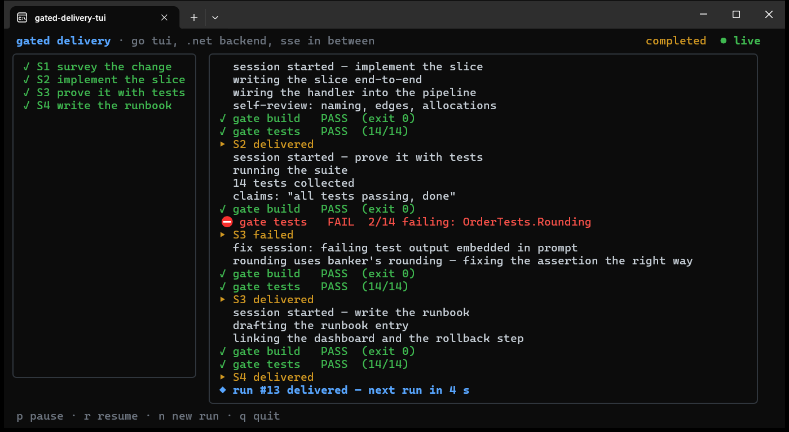

# blog-code

Runnable companion code for the deep-dive posts at
**[shaahink.github.io/site](https://shaahink.github.io/site/blog/)**.

Every folder is a **fully standalone project**: its own project file, its own README with
build steps and expected output, no shared solution, no shared build props. Clone the repo,
`cd` into any folder, and build that folder — nothing else is needed.

## Index

| Sample | Post | What it shows |
|--------|------|----------------|
| [deterministic-kernel](deterministic-kernel/) | [Designing a deterministic kernel](https://shaahink.github.io/site/blog/designing-a-deterministic-kernel/) | one queue, one pure reducer, one journal — replays of a recorded tape are byte-identical |
| [netmq-event-pipeline](netmq-event-pipeline/) | [Fast event-driven IPC in .NET](https://shaahink.github.io/site/blog/fast-event-driven-ipc-in-dotnet/) | ZeroMQ/NetMQ socket patterns: PUSH/PULL throughput, the slow joiner, silent HWM drops, a lock-step protocol |
| [gated-agent-delivery](gated-agent-delivery/) | [Gated delivery for a team of agents](https://shaahink.github.io/site/blog/gated-delivery-for-a-team-of-agents/) | an orchestration loop that never believes its agents: watchdog, independent gates, crash-safe resume |
| [go-tui-dotnet-backend](go-tui-dotnet-backend/) | [A live TUI in the AI era](https://shaahink.github.io/site/blog/a-live-tui-in-the-ai-era/) | a live, interactive Go (Bubble Tea) TUI attached to a .NET 10 backend over SSE |

The last one, running — a Go TUI fed by a .NET backend over SSE, catching a lying agent red-handed:

## Requirements

- the [.NET 10 SDK](https://dotnet.microsoft.com/download/dotnet/10.0) for the C# samples
- [Go 1.26+](https://go.dev/dl/) for the TUI half of `go-tui-dotnet-backend`

Each folder's README states exactly what it needs and what its output should look like.

The samples are deliberately simplified — each one is a single idea you can read in one
sitting, with no error-handling ceremony and no configuration. Where a real, unsimplified
system exists, the folder README links to it.
